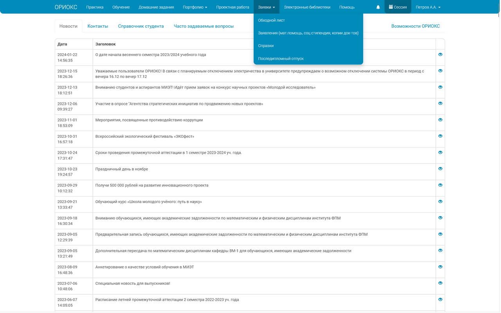
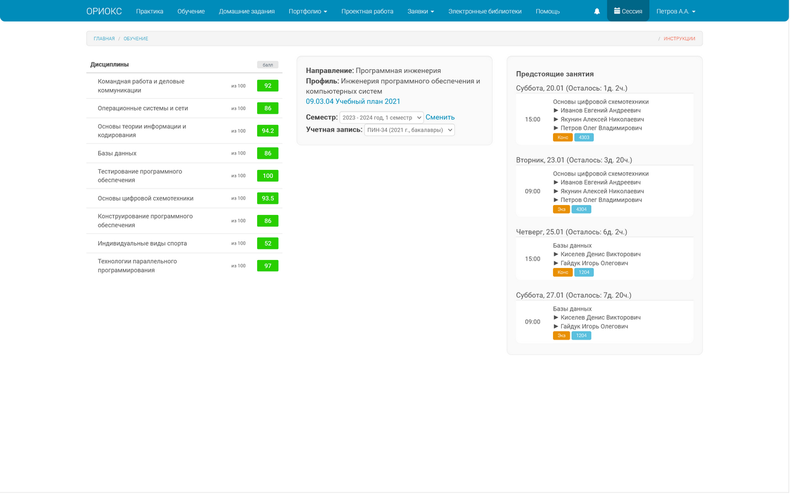

# Better web-ORIOKS

Это небольшое браузерное расширение — в том числе и адаптированное под мобильные
устройства, — попытка починить сайт ОРИОКСа для более удобного и приятного его
использования

Совместимо с [Dark Reader](https://github.com/darkreader/darkreader) _(рекомендую)_

---

### Что конкретно делает расширение:

- **Чинит подсчёт баллов**: учитываются все полученные за семестр баллы, даже если соответствующие
  контрольные мероприятия по плану ещё не наступили, и делает это лучше встроенного функционала
- **Меняет окрашивание баллов**: в частности, зачётные дисциплины при наборе половины баллов
  становятся зелёными. Ну и вследствие перерасчёта всех сумм остальные дисциплины тоже выглядят
  как минимум не хуже оригинала
- **Дорабатывает расписание**: добавляет преподавателя, улучшает принцип отображения ближайших занятий
    - В том числе **добавляет расписание сессии** по окончании семестра
- **Улучшает внешний вид**: меняет некоторые размеры элементов для лучшей читаемости, а также
  подскругляет углы у откровенно прямоугольных элементов

Скриншоты

- Главная страница (новости)

- Страница с расписанием + экзамены

Некоторые детали [указаны ниже](#faqчаво-но-это-ответы)

---

### Установка:

1. Установите расширение из подходящего магазина расширений: [Firefox Add-ons](https://addons.mozilla.org/ru/firefox/addon/better-web-orioks/)
   или [Chrome Web Store](https://chromewebstore.google.com/detail/better-web-orioks/lfklcdejbjncohabmalekhndjjafoacm?hl=ru) (ещё можно нажимать на [бейджики наверху](#better-web-orioks)).
   Второй вариант подойдёт для большинства браузеров, лично проверены `Яндекс.Браузер` (в том числе
   на Android), `Chrome`, `Edge` и `Opera`.
2. ??? 
3. PROFIT
4. **[Firefox] _Опционально_**: автообновление расширения для `наилучшего опыта использования`:
    1. `Ctrl + Shift + A` или `☰ -> Настройки -> Расширения и темы`
    2. Находим `Better web-ORIOKS` и нажимаем
    3. `Автоматическое обновление -> Включено`

---

### FAQ/ЧаВо, но это ответы:

- Меняется количество баллов на стандартной раскладке "балл", и, соответсвенно, проценты
  на "%", а на раскладке "сум" остаётся оригинальное количество, ну вдруг кому интересно
- Проценты больше 100 оставлены специально, так забавнее с точки зрения автора
- Расписание учитывает тип недели, день и время для отображения незакончившихся пар
  текущего дня или, при их отсутствии, ближайшего, их имеющего (в отличие от оригинальной
  реализации)
- Расписание игнорирует занятия в УВЦ (он же военная кафедра), потому что ~~нормальных~~
  обычных людей это отвлекает, а кому надо, те и сами в курсе
- В расписание добавлены ФИО преподавателей, они берутся со [страницы расписания](https://miet.ru/schedule),
  грубо говоря (на деле с того же сервера, откуда и данные для той страницы), так что могут
  не соответствовать действительности, но тут автор полностью невиновный. А для экзаменов указаны
  преподаватели, что указаны прямо в ОРИОКСе
- Проверка обновления данных расписания происходит при запуске браузера (профиля браузера), установке/обновлении
  расширения или посещении [запросе к] `orioks.miet.ru/*`, но не чаще раза в 6 часов
- Касательно Manifest: в репозитории лежит две версии, `V2` для Firefox (в том числе Android),
  а `V3`, соответственно, для остального. Пока для мобильной версии «Лисы» иначе совсем никак, а для
  старшей банально удобнее

---

### TODO _(оно же планы)_:

- [ ] Встроенная тёмная тема
- [ ] Графическая информация о баллах по типам контрольных мероприятий
- [x] ~~Адаптация и выпуск в Chrome Web Store~~
- [x] ~~Переезд на Manifest V3~~
- [x] ~~Переработка подгрузки расписаний~~
- [x] ~~"Освежение" интерфейса скруглёнными углами~~
- [x] ~~Отображение экзаменов в расписании~~

---

### Контакты:

- **Предложения, ошибки, вопросы**: [GitHub Issues](https://github.com/Psychosoc1al/better-web-orioks/issues)
- **Telegram на крайний случай**: [@TTa3lCblJlou](https://t.me/TTa3lCblJlou) _(это типа пажылой...)_
